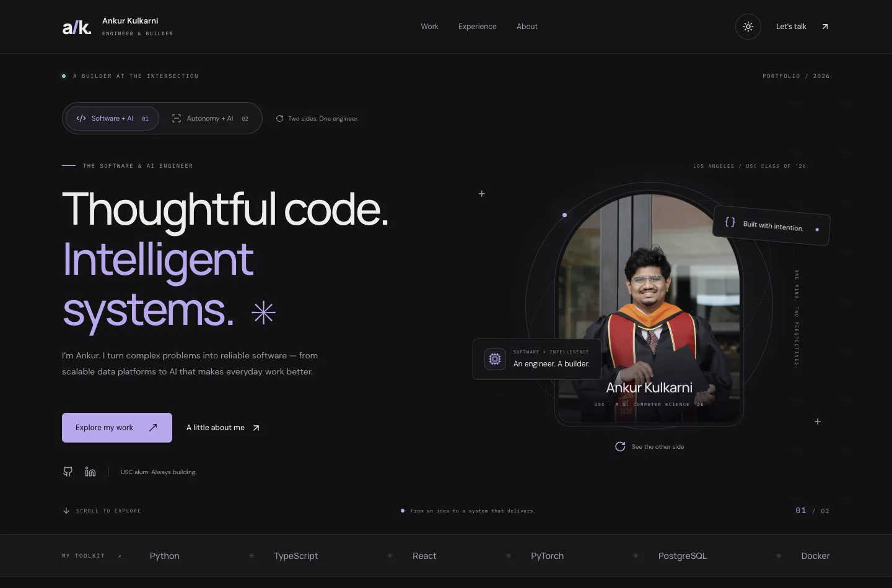
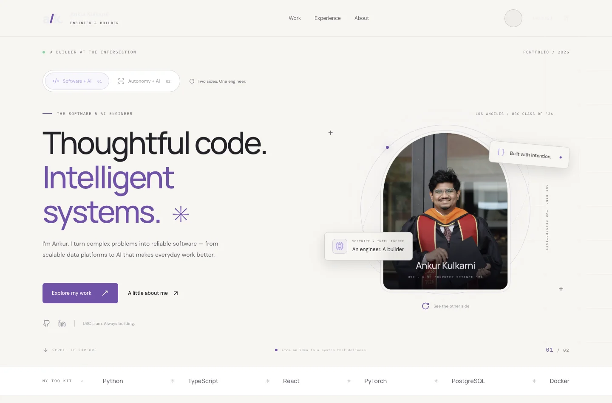

# Ankur Kulkarni · Portfolio

A responsive React portfolio built around two connected perspectives: **Software + AI** and **Autonomy + AI**. Switching perspectives rotates the graduation portrait, changes the accent palette and headline, and surfaces relevant projects, tools, and evidence.

## Run locally

```sh
pnpm install
pnpm dev
```

```sh
pnpm build    # production assets in dist/
pnpm preview  # preview the production build
pnpm lint
```

Uses the existing React 19 / Vite 6 toolchain, Framer Motion, and Lucide icons. The Vite cache is stored in the ignored `.vite/` folder.

## Design and interaction

- Charcoal/lilac and warm light themes; teal accents for autonomous systems.
- User-controlled 3D portrait rotation, animated technical illustrations, scroll reveals, and subtle orbital motion.
- OS theme and reduced-motion preferences respected on first visit; explicit choices persist locally.
- A persistent motion toggle, keyboard-accessible controls, skip link, responsive navigation, and native project dialogs with Escape dismissal and focus management.
- Six project case studies with scope, approach, outcomes, and a code link where a matching public repository is available.
- Optimized 77 KB WebP graduation portrait. Typography uses Google Fonts with local system fallbacks.

## Content

Edit `src/data/portfolio.js` to update perspectives, metrics, projects, experience, and social links. Education and the privacy prototype appear in `src/components/About.jsx`. Shared visual tokens and responsive layouts are in `src/index.css` and `src/App.css`.

Experience and project descriptions are grounded in the two supplied resumes. Autonomous systems results are labeled as simulation results. The medical language model is described as a technical prototype, not a clinically validated product.

## Privacy

No personal email address or telephone number appears in the website, metadata, or new static assets. Contact links lead to GitHub and LinkedIn. The two old resume PDFs were removed from the application source because their contact details should not be published. The newly supplied originals are not copied into this repository. Earlier Git history is unchanged.

## Deployment

This is a static Vite application compatible with the existing Vercel hosting. Build with `pnpm build` and serve `dist/`. There are no API keys, server functions, or form backends to configure. The redesign is prepared on a review branch; merging or publishing is a separate action.

## Browser verification

Validated using Chrome at 320, 375, 390, 430, 768, 1024, and 1440 CSS pixels:

- Both perspectives, their matching project filters, and the all-projects view.
- Project dialogs, Escape dismissal, and mobile navigation.
- Light and dark appearance and persistence across reloads.
- Reduced-motion preferences and persistent motion controls.
- Portrait loading, absence of runtime errors, and absence of horizontal overflow.
- No telephone/email links or contact details in the rendered page.

Automated axe-core WCAG A/AA checks pass in all four theme/perspective combinations. Lint passes with six existing Fast Refresh warnings in the unused legacy UI component library.

## Preview




